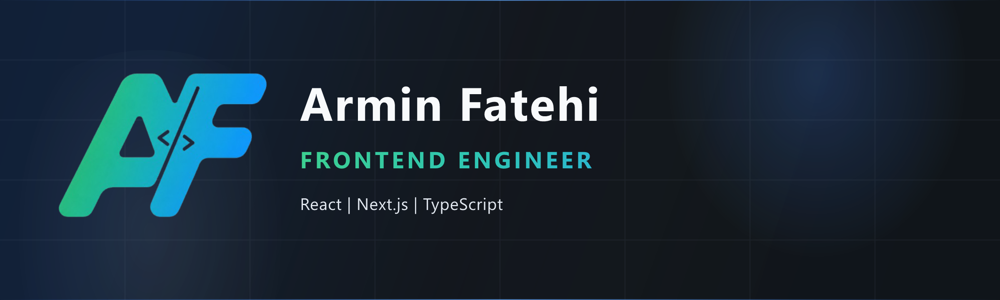

<!--
  Armin Fatehi — GitHub Profile
  Premium personal landing page · Frontend Engineer
-->

  

    

  
  
  
  
  

   

  

 

 

## About

I'm **Armin Fatehi** — a Frontend Engineer with **6+ years** of experience shipping production web applications.

I don't build tutorial projects. I build products that feel like real SaaS and enterprise software: clear architecture, intentional UX, measurable performance, and code that teams can maintain months later.

My focus sits at the intersection of **product thinking** and **frontend systems** — feature-based architecture, scalable component design, RBAC, optimistic UI, and performance-conscious delivery with React, Next.js, and TypeScript.

> If it ships to users, it should be designed like a product — not a demo.

 

 

## Current Focus

<table>
  <tr>
    <td width="33%" valign="top">
      <strong>Production SaaS</strong> 
      Shipping durable product surfaces — dashboards, workflows, and real-time UX.
    </td>
    <td width="33%" valign="top">
      <strong>Backend Architecture</strong> 
      Deepening system design, API boundaries, and how frontend systems integrate cleanly.
    </td>
    <td width="33%" valign="top">
      <strong>System Design</strong> 
      Improving scalability patterns, performance budgets, and maintainable architecture.
    </td>
  </tr>
</table>

 

 

## Featured Projects

Production-oriented applications — not portfolio demos.

 

<table>
  <tr>
    <td width="50%" valign="top">
      <h3><a href="https://github.com/Arminfaa/planora-app">Planora</a></h3>
      
<em>Production-ready project management platform</em>

      

        Real-time Kanban · Activity Feed · RBAC (37+ permissions) 
        Optimistic UI · Responsive Dashboard
      

      

        
        
        
      

    </td>
    <td width="50%" valign="top">
      <h3><a href="https://github.com/Arminfaa/pocketa">Pocketa</a></h3>
      
<em>Production-ready Persian personal finance platform</em>

      

        Budgeting · Transactions · Bank SMS Import 
        Savings Goals · Investments · Mobile-first PWA
      

      

        
        
        
      

    </td>
  </tr>
  <tr>
    <td width="50%" valign="top">
      <h3><a href="https://github.com/Arminfaa/cove-app">Cove</a></h3>
      
<em>Production-oriented hotel booking platform</em>

      

        Interactive Maps · Booking Flows 
        Guest / Host / Admin · Availability Calendar
      

      

        
        
        
      

    </td>
    <td width="50%" valign="top">
      <h3><a href="https://github.com/Arminfaa/shopora-app">Shopora</a></h3>
      
<em>Modern multilingual e-commerce platform</em>

      

        Storefront · Dashboard · Authentication 
        Admin Panel · Multilingual Experience
      

      

        
        
        
      

    </td>
  </tr>
  <tr>
    <td width="50%" valign="top">
      <h3><a href="https://github.com/Arminfaa/StoryHub">StoryHub</a></h3>
      
<em>Production-ready Blog CMS</em>

      

        Multilingual Content · SEO-first Architecture 
        Authentication · Editorial Dashboard
      

      

        
        
        
      

    </td>
    <td width="50%" valign="top">
      <h3><a href="https://github.com/Arminfaa/formora-app">Formora</a></h3>
      
<em>Dynamic Form Builder</em>

      

        Drag &amp; Drop Builder · Schema Validation 
        Dynamic Components · Configurable Fields
      

      

        
        
        
      

    </td>
  </tr>
</table>

 

  
<strong>Enterprise experience</strong>

   
  Beyond product work, I've contributed to enterprise-facing platforms including:
    
  <ul>
    <li><strong>Enterprise ERP</strong> — complex workflows, permissions, and operational UI at scale</li>
    <li><strong>Digital Library</strong> — content systems with search, access control, and structured catalogs</li>
    <li><strong>Event Platform</strong> — scheduling, registrations, and multi-role product surfaces</li>
  </ul>

 

 

## Tech Stack

Organized by how I actually use it — not a badge wall.

 

<table>
  <tr>
    <td width="50%" valign="top">
      <strong>Core</strong>  
      
      
      
      
    </td>
    <td width="50%" valign="top">
      <strong>Frontend Architecture</strong>  
      Feature-based Architecture · Component Design 
      Scalable Frontend · RBAC
    </td>
  </tr>
  <tr>
    <td width="50%" valign="top">
      <strong>State Management</strong>  
      
      
      
    </td>
    <td width="50%" valign="top">
      <strong>Data Layer</strong>  
      
      
      
    </td>
  </tr>
  <tr>
    <td width="50%" valign="top">
      <strong>Styling &amp; Motion</strong>  
      
      
      
    </td>
    <td width="50%" valign="top">
      <strong>Forms</strong>  
      
      
    </td>
  </tr>
  <tr>
    <td width="50%" valign="top">
      <strong>Performance</strong>  
      SSR · ISR · SSG · Lazy Loading · Code Splitting
    </td>
    <td width="50%" valign="top">
      <strong>Testing</strong>  
      
      
    </td>
  </tr>
  <tr>
    <td colspan="2" valign="top">
      <strong>Backend Knowledge</strong>  
      
      
      
    </td>
  </tr>
</table>

 

 

## GitHub Stats

  
  

   

  

 

 

## Contribution Graph

  

 

 

## Development Philosophy

I believe great frontend engineering is **not** about creating components.

It's about building **maintainable systems that scale** — clear boundaries, predictable data flow, intentional UX, and architecture that stays coherent as the product grows.

| Principle | What it means in practice |
| --- | --- |
| **Systems over screens** | Design for change, ownership, and long-term maintainability |
| **Product over demos** | Ship experiences users can trust in production |
| **Performance as UX** | Load less, render smarter, measure what matters |
| **Architecture as leverage** | Feature boundaries, RBAC, and reusable patterns compound |

 

 

## Fun Facts

- Prefer building **systems** over assembling UI kits
- Obsess over **developer experience** almost as much as user experience
- Care about the details recruiters never see — naming, boundaries, and failure states
- Happiest when a codebase feels calm under complexity

 

 

## Connect

Open to conversations about frontend architecture, product engineering, and production-ready web systems.

 

  
  &nbsp;
  
  &nbsp;
  
  &nbsp;
  

 

  Built with intention · Designed like a product · Maintained like production code

    

  

